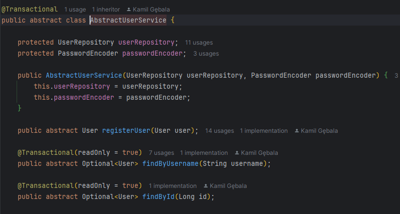
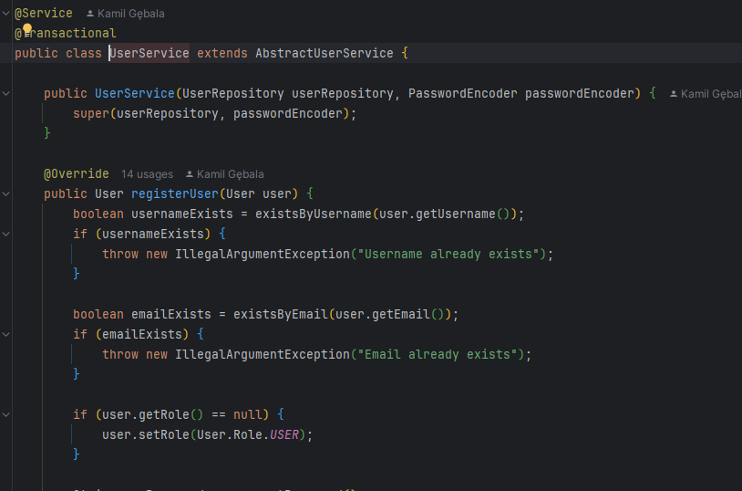
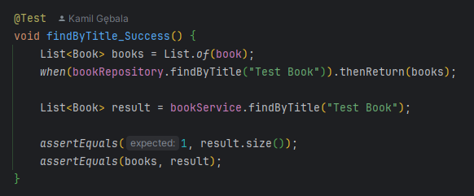
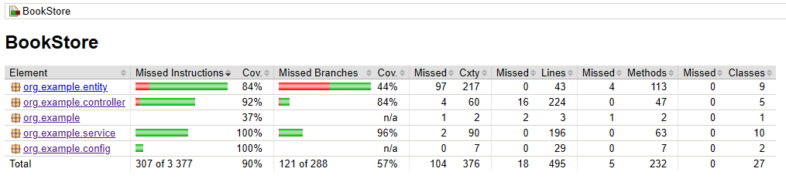

# Dokumentacja

## Temat 

BookStore - aplikacja do zarządzania księgarnią

## Opis 

Bookstore - aplikacja do zarządzania książkami, użytkownikami, rezerwacjami oraz wypożyczeniami książek, przy pomocy SpringBoot, Dockera, Mavena, Swagera oraz PostgreSQL.

# Realizowane systemy

## Struktura

Projekt jest zorganizowany w następujące pakiety:

- **config**: Zawiera klasy konfiguracyjne aplikacji
  - OpenApiConfig: Konfiguracja Swagger/OpenAPI
  - SecurityConfig: Konfiguracja Spring Security

- **controller**: Zawiera kontrolery REST API
  - AuthController: Zarządzanie autentykacją użytkowników
  - BookController: Zarządzanie książkami
  - BookLoanController: Zarządzanie wypożyczeniami książek
  - BookReservationController: Zarządzanie rezerwacjami książek
  - UserController: Zarządzanie użytkownikami

- **entity**: Zawiera encje bazodanowe
  - Book: Encja reprezentująca książkę
  - BookLoan: Encja reprezentująca wypożyczenie książki
  - BookReservation: Encja reprezentująca rezerwację książki
  - User: Encja reprezentująca użytkownika

- **repository**: Zawiera interfejsy repozytoriów
  - BookRepository: Repozytorium dla encji Book
  - BookLoanRepository: Repozytorium dla encji BookLoan
  - BookReservationRepository: Repozytorium dla encji BookReservation
  - UserRepository: Repozytorium dla encji User

- **service**: Zawiera klasy serwisowe
  - AbstractBookService i BookService: Serwis do zarządzania książkami
  - AbstractBookLoanService i BookLoanService: Serwis do zarządzania wypożyczeniami
  - AbstractBookReservationService i BookReservationService: Serwis do zarządzania rezerwacjami
  - AbstractUserService i UserService: Serwis do zarządzania użytkownikami
  - AbstractUserDetailsService i UserDetailsService: Serwis do autentykacji użytkowników

## Wzorce projektowe

W projekcie zastosowano następujące wzorce projektowe:

1. **Wzorzec Template Method**: Zastosowany w klasach serwisowych poprzez użycie klas abstrakcyjnych (np. AbstractUserService) i ich konkretnych implementacji (np. UserService).

2. **Wzorzec Repository**: Zastosowany poprzez interfejsy repozytoriów rozszerzające JpaRepository, co zapewnia standardowe operacje CRUD na encjach.

3. **Wzorzec Dependency Injection**: Zastosowany poprzez wstrzykiwanie zależności za pomocą adnotacji @Autowired i konstruktorów z adnotacją @RequiredArgsConstructor.

4. **Wzorzec Builder**: Zastosowany w encjach poprzez użycie adnotacji @Builder z biblioteki Lombok.

5. **Wzorzec MVC (Model-View-Controller)**: Zastosowany poprzez podział aplikacji na warstwy modelu (entity, repository), kontrolera (controller) i widoku (API REST).

## Kontrolery

Aplikacja udostępnia następujące kontrolery REST API:

1. **AuthController** - Zarządzanie autentykacją
   - POST /api/auth/register - Rejestracja nowego użytkownika
   - POST /api/auth/register/admin - Rejestracja nowego administratora
   - GET /api/auth/me - Informacje o zalogowanym użytkowniku

2. **BookController** - Zarządzanie książkami
   - POST /api/books - Dodanie nowej książki
   - GET /api/books/{id} - Pobranie książki po ID
   - GET /api/books - Pobranie wszystkich książek
   - GET /api/books/title/{title} - Wyszukiwanie książek po tytule
   - GET /api/books/author/{author} - Wyszukiwanie książek po autorze
   - GET /api/books/available - Pobranie dostępnych książek
   - PUT /api/books/{id} - Aktualizacja książki
   - DELETE /api/books/{id} - Usunięcie książki

3. **BookLoanController** - Zarządzanie wypożyczeniami
   - POST /api/loans - Utworzenie nowego wypożyczenia
   - GET /api/loans/{id} - Pobranie wypożyczenia po ID
   - GET /api/loans/user/{userId} - Pobranie wypożyczeń użytkownika
   - GET /api/loans/book/{bookId} - Pobranie wypożyczeń książki
   - GET /api/loans/active - Pobranie aktywnych wypożyczeń
   - GET /api/loans/active/user/{userId} - Pobranie aktywnych wypożyczeń użytkownika
   - GET /api/loans/active/book/{bookId} - Pobranie aktywnych wypożyczeń książki
   - GET /api/loans - Pobranie wszystkich wypożyczeń
   - GET /api/loans/overdue - Pobranie przeterminowanych wypożyczeń
   - PUT /api/loans/{id}/return - Zwrot książki

4. **BookReservationController** - Zarządzanie rezerwacjami
   - POST /api/reservations - Utworzenie nowej rezerwacji
   - GET /api/reservations/{id} - Pobranie rezerwacji po ID
   - GET /api/reservations/user/{userId} - Pobranie rezerwacji użytkownika
   - GET /api/reservations/book/{bookId} - Pobranie rezerwacji książki
   - GET /api/reservations/active/user/{userId} - Pobranie aktywnych rezerwacji użytkownika
   - GET /api/reservations/active/book/{bookId} - Pobranie aktywnych rezerwacji książki
   - GET /api/reservations - Pobranie wszystkich rezerwacji
   - GET /api/reservations/active - Pobranie aktywnych rezerwacji
   - GET /api/reservations/expired - Pobranie wygasłych rezerwacji
   - PUT /api/reservations/{id}/cancel - Anulowanie rezerwacji
   - POST /api/reservations/process-expired - Przetwarzanie wygasłych rezerwacji

5. **UserController** - Zarządzanie użytkownikami
   - GET /api/users/get/{id} - Pobranie użytkownika po ID
   - GET /api/users/username/{username} - Pobranie użytkownika po nazwie użytkownika
   - GET /api/users - Pobranie wszystkich użytkowników
   - PUT /api/users/{id} - Aktualizacja użytkownika
   - DELETE /api/users/{id} - Usunięcie użytkownika
   - GET /api/users/exists/username/{username} - Sprawdzenie czy istnieje użytkownik o podanej nazwie
   - GET /api/users/exists/email/{email} - Sprawdzenie czy istnieje użytkownik o podanym adresie email

## Tabele bazodanowe

Aplikacja korzysta z następujących tabel w bazie danych:

1. **Book** - Przechowuje informacje o książkach
   - id: Long (klucz główny)
   - title: String (tytuł książki)
   - author: String (autor książki)
   - description: String (opis książki)
   - quantity: Integer (całkowita liczba egzemplarzy)
   - availableQuantity: Integer (liczba dostępnych egzemplarzy)

2. **BookLoan** - Przechowuje informacje o wypożyczeniach
   - id: Long (klucz główny)
   - user: User (użytkownik wypożyczający książkę)
   - book: Book (wypożyczona książka)
   - loanDate: LocalDateTime (data wypożyczenia)
   - dueDate: LocalDateTime (termin zwrotu)
   - returnDate: LocalDateTime (data faktycznego zwrotu)
   - returned: boolean (czy książka została zwrócona)

3. **BookReservation** - Przechowuje informacje o rezerwacjach
   - id: Long (klucz główny)
   - user: User (użytkownik rezerwujący książkę)
   - book: Book (zarezerwowana książka)
   - reservationDate: LocalDateTime (data rezerwacji)
   - expirationDate: LocalDateTime (data wygaśnięcia rezerwacji)
   - active: boolean (czy rezerwacja jest aktywna)

4. **User** - Przechowuje informacje o użytkownikach
   - id: Long (klucz główny)
   - username: String (nazwa użytkownika)
   - password: String (hasło użytkownika)
   - email: String (adres email)
   - role: Role (rola użytkownika: USER lub ADMIN)

## Polimorfizm

Projekt wykożystuje polimorfizm jak wskazano w wymaganiach projektowych (np 'AbstractUserService' i 'UserService')

## Testy (Jacoco)

Przykładowy test (klasy 'Book')

Testy spełniają wymaganie dotyczące pokrycia kodu

