# Dokumentacja

Kamil Gębala 151868

## I.Temat 

BookStore - aplikacja do zarządzania księgarnią

## II.Opis 

Bookstore - aplikacja do zarządzania książkami, użytkownikami, rezerwacjami oraz wypożyczeniami książek, przy pomocy SpringBoot, Dockera, Mavena, Swagera oraz PostgreSQL.

## III.Realizowane systemy

1.  System książek
    - dodawanie 
    - usuwanie
    - modyfikacja
    - wyszukiwanie z filtrami

2.  System zarządzania użytkownikami
    - User: Przeglądanie książek po filtrach, wyszukiwanie, rezerwacja, anulowanie rezerwacji, wypożyczenie, zwrot, informacje o użytkowniku
    - Admin: Wszystkie funkcjonalnosci usera rozszerzone o zarządzanie każdym systemem(dodawanie, usuwanie, modyfikowanie - ksiązek, użytkowników, rezerwacji, wypożyczeń, rozszerzone filtry wyszukiwania)

3.  System rezerwacji
    - tworzenie 
    - anulowanie 
    - przetwarzanie przedawnionych
    - wyszukiwanie po id, uzytkowniku, ksiażce, aktywności, kombinacji wcześniejszych
    - historia rezerwacji

4.  System wypożyczeń
    - tworzenie
    - zwrot
    - przetwarzanie przedawnionych
    - wyszukiwanie po id, uzytkowniku, ksiażce, aktywności, kombinacji wcześniejszych
    - historia wypożyczeń

5.  System autoryzacji
    - kontrola oparta na rolach
    - rejestracja i logowanie uzytkowników
    - informacje o bieżącym użytkowniku

## IV.Struktura Projektu

```
src/
├── main/
│   ├── java/org/example/
│   │   ├── config/          # Konfiguracja Spring Security, Swagger
│   │   │   ├── OpenApiConfig.java
│   │   │   └── SecurityConfig.java
│   │   ├── controller/      # Kontrolery REST
│   │   │   ├── AuthController.java
│   │   │   ├── BookController.java
│   │   │   ├── BookLoanController.java
│   │   │   ├── BookReservationController.java
│   │   │   └── UserController.java
│   │   ├── entity/          # Encje JPA
│   │   │   ├── Book.java
│   │   │   ├── BookLoan.java
│   │   │   ├── BookReservation.java
│   │   │   └── User.java
│   │   ├── repository/      # Repozytoria Spring Data
│   │   │   ├── BookRepository.java
│   │   │   ├── BookLoanRepository.java
│   │   │   ├── BookReservationRepository.java
│   │   │   └── UserRepository.java
│   │   ├── service/         # Logika service
│   │   │   ├── AbstractBookService.java
│   │   │   ├── AbstractBookLoanService.java
│   │   │   ├── AbstractBookReservationService.java
│   │   │   ├── AbstractUserService.java
│   │   │   ├── AbstractUserDetailsService.java
│   │   │   ├── BookService.java
│   │   │   ├── BookLoanService.java
│   │   │   ├── BookReservationService.java
│   │   │   ├── UserService.java
│   │   │   └── UserDetailsService.java
│   │   └── Main.java
│   └── resources/
│       ├── db/migration/    # Migracje Flyway
│       ├── templates/
│       └── application.properties
└── test/                    # Testy jednostkowe i integracyjne
└── java/org/example/
├── config/          # Testy konfiguracji
│   ├── OpenApiConfigTest.java
│   └── SecurityConfigTest.java
├── controller/      # Testy kontrolerów
│   ├── AuthControllerTest.java
│   ├── BookControllerTest.java
│   ├── BookLoanControllerTest.java
│   ├── BookReservationControllerTest.java
│   └── UserControllerTest.java
├── entity/          # Testy encji
│   ├── BookLoanTest.java
│   ├── BookReservationTest.java
│   ├── BookTest.java
│   └── UserTest.java
├── service/         # Testy service
│   ├── BookLoanServiceTest.java
│   ├── BookReservationServiceTest.java
│   ├── BookServiceTest.java
│   ├── UserDetailsServiceTest.java
│   └── UserServiceTest.java
└── MainTest.java    # Główna klasa testowa
```

## V.Diagram ERD

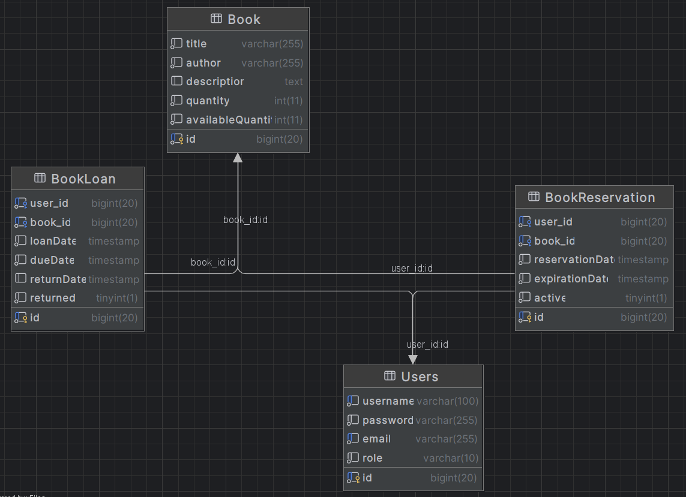

## VI.Tabele bazodanowe

Aplikacja korzysta z następujących tabel w bazie danych:

1. **Book** - Przechowuje informacje o książkach
    - id: Long (klucz główny)
    - title: String (tytuł książki)
    - author: String (autor książki)
    - description: String (opis książki)
    - quantity: Integer (całkowita liczba egzemplarzy)
    - availableQuantity: Integer (liczba dostępnych egzemplarzy)

2. **BookLoan** - Przechowuje informacje o wypożyczeniach
    - id: Long (klucz główny)
    - user: User (użytkownik wypożyczający książkę)
    - book: Book (wypożyczona książka)
    - loanDate: LocalDateTime (data wypożyczenia)
    - dueDate: LocalDateTime (termin zwrotu)
    - returnDate: LocalDateTime (data faktycznego zwrotu)
    - returned: boolean (czy książka została zwrócona)

3. **BookReservation** - Przechowuje informacje o rezerwacjach
    - id: Long (klucz główny)
    - user: User (użytkownik rezerwujący książkę)
    - book: Book (zarezerwowana książka)
    - reservationDate: LocalDateTime (data rezerwacji)
    - expirationDate: LocalDateTime (data wygaśnięcia rezerwacji)
    - active: boolean (czy rezerwacja jest aktywna)

4. **User** - Przechowuje informacje o użytkownikach
    - id: Long (klucz główny)
    - username: String (nazwa użytkownika)
    - password: String (hasło użytkownika)
    - email: String (adres email)
    - role: Role (rola użytkownika: USER lub ADMIN)

## VII.Pakiety Główne

Projekt jest zorganizowany w następujące pakiety:

- **config**: Zawiera klasy konfiguracyjne aplikacji
  - OpenApiConfig: Konfiguracja Swagger/OpenAPI
  - SecurityConfig: Konfiguracja Spring Security

- **controller**: Zawiera kontrolery REST API
  - AuthController: Zarządzanie autentykacją użytkowników
  - BookController: Zarządzanie książkami
  - BookLoanController: Zarządzanie wypożyczeniami książek
  - BookReservationController: Zarządzanie rezerwacjami książek
  - UserController: Zarządzanie użytkownikami

- **entity**: Zawiera encje bazodanowe
  - Book: Encja reprezentująca książkę
  - BookLoan: Encja reprezentująca wypożyczenie książki
  - BookReservation: Encja reprezentująca rezerwację książki
  - User: Encja reprezentująca użytkownika

- **repository**: Zawiera interfejsy repozytoriów
  - BookRepository: Repozytorium dla encji Book
  - BookLoanRepository: Repozytorium dla encji BookLoan
  - BookReservationRepository: Repozytorium dla encji BookReservation
  - UserRepository: Repozytorium dla encji User

- **service**: Zawiera klasy serwisowe
  - AbstractBookService i BookService: Serwis do zarządzania książkami
  - AbstractBookLoanService i BookLoanService: Serwis do zarządzania wypożyczeniami
  - AbstractBookReservationService i BookReservationService: Serwis do zarządzania rezerwacjami
  - AbstractUserService i UserService: Serwis do zarządzania użytkownikami
  - AbstractUserDetailsService i UserDetailsService: Serwis do autentykacji użytkowników

## VIII.Kontrolery

Aplikacja udostępnia następujące kontrolery REST API:

1. **AuthController** - Zarządzanie autentykacją
   - POST /api/auth/register - Rejestracja nowego użytkownika
   - POST /api/auth/register/admin - Rejestracja nowego administratora
   - GET /api/auth/me - Informacje o zalogowanym użytkowniku

2. **BookController** - Zarządzanie książkami
   - POST /api/books - Dodanie nowej książki
   - GET /api/books/{id} - Pobranie książki po ID
   - GET /api/books - Pobranie wszystkich książek
   - GET /api/books/title/{title} - Wyszukiwanie książek po tytule
   - GET /api/books/author/{author} - Wyszukiwanie książek po autorze
   - GET /api/books/available - Pobranie dostępnych książek
   - PUT /api/books/{id} - Aktualizacja książki
   - DELETE /api/books/{id} - Usunięcie książki

3. **BookLoanController** - Zarządzanie wypożyczeniami
   - POST /api/loans - Utworzenie nowego wypożyczenia
   - GET /api/loans/{id} - Pobranie wypożyczenia po ID
   - GET /api/loans/user/{userId} - Pobranie wypożyczeń użytkownika
   - GET /api/loans/book/{bookId} - Pobranie wypożyczeń książki
   - GET /api/loans/active - Pobranie aktywnych wypożyczeń
   - GET /api/loans/active/user/{userId} - Pobranie aktywnych wypożyczeń użytkownika
   - GET /api/loans/active/book/{bookId} - Pobranie aktywnych wypożyczeń książki
   - GET /api/loans - Pobranie wszystkich wypożyczeń
   - GET /api/loans/overdue - Pobranie przeterminowanych wypożyczeń
   - PUT /api/loans/{id}/return - Zwrot książki

4. **BookReservationController** - Zarządzanie rezerwacjami
   - POST /api/reservations - Utworzenie nowej rezerwacji
   - GET /api/reservations/{id} - Pobranie rezerwacji po ID
   - GET /api/reservations/user/{userId} - Pobranie rezerwacji użytkownika
   - GET /api/reservations/book/{bookId} - Pobranie rezerwacji książki
   - GET /api/reservations/active/user/{userId} - Pobranie aktywnych rezerwacji użytkownika
   - GET /api/reservations/active/book/{bookId} - Pobranie aktywnych rezerwacji książki
   - GET /api/reservations - Pobranie wszystkich rezerwacji
   - GET /api/reservations/active - Pobranie aktywnych rezerwacji
   - GET /api/reservations/expired - Pobranie wygasłych rezerwacji
   - PUT /api/reservations/{id}/cancel - Anulowanie rezerwacji
   - POST /api/reservations/process-expired - Przetwarzanie wygasłych rezerwacji

5. **UserController** - Zarządzanie użytkownikami
   - GET /api/users/get/{id} - Pobranie użytkownika po ID
   - GET /api/users/username/{username} - Pobranie użytkownika po nazwie użytkownika
   - GET /api/users - Pobranie wszystkich użytkowników
   - PUT /api/users/{id} - Aktualizacja użytkownika
   - DELETE /api/users/{id} - Usunięcie użytkownika
   - GET /api/users/exists/username/{username} - Sprawdzenie czy istnieje użytkownik o podanej nazwie
   - GET /api/users/exists/email/{email} - Sprawdzenie czy istnieje użytkownik o podanym adresie email

## IX.Polimorfizm

Projekt wykożystuje polimorfizm jak wskazano w wymaganiach projektowych (np 'AbstractUserService' i 'UserService')
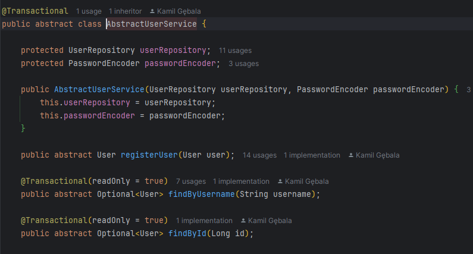
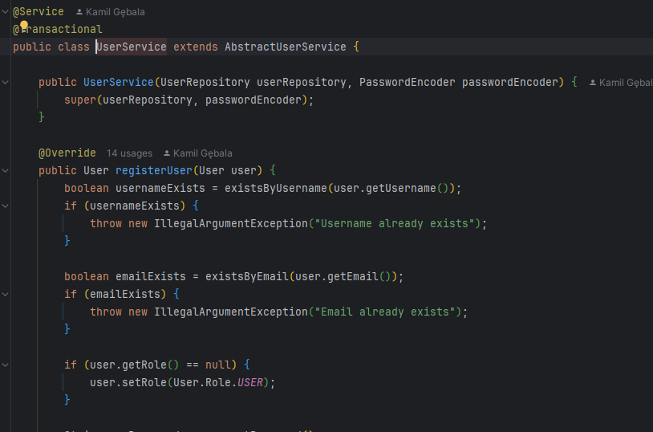

## X.Wzorce projektowe

W projekcie zastosowano następujące wzorce projektowe:

1. **Wzorzec Template Method**: Zastosowany w klasach serwisowych poprzez użycie klas abstrakcyjnych (np. AbstractUserService) i ich konkretnych implementacji (np. UserService).

2. **Wzorzec Repository**: Zastosowany poprzez interfejsy repozytoriów rozszerzające JpaRepository, co zapewnia standardowe operacje CRUD na encjach.

3. **Wzorzec Dependency Injection**: Zastosowany poprzez wstrzykiwanie zależności za pomocą adnotacji @Autowired i konstruktorów z adnotacją @RequiredArgsConstructor.

4. **Wzorzec Builder**: Zastosowany w encjach poprzez użycie adnotacji @Builder z biblioteki Lombok.

5. **Wzorzec MVC (Model-View-Controller)**: Zastosowany poprzez podział aplikacji na warstwy modelu (entity, repository), kontrolera (controller) i widoku (API REST).

## XI.Uruchamianie Projektu

1.  Pobranie repozytorum git

```bash
git clone https://github.com/XPiraniaX/BookStore-Projekt-Java
```

2. Uruchomienie przy pomocy Mavena

```bash
mvn clean package -DskipTests
```

3.  Połączenie z Dockerem

```bash
docker-decompose up --build
```

4.  Swagger

[Swagger UI](http://localhost:8080/swagger-ui/index.html#/)

5.  Wbudowani użytkownicy

- 'user' / 'user' - standardowy użytkownik
- 'admin' / 'admin' - administrator (wszystkie uprawnienia)
## XII. Autoryzacja

Aplikacja implementuje kompleksowy system autoryzacji i uwierzytelniania użytkowników, zapewniający bezpieczny dostęp do zasobów systemu.

### Mechanizm uwierzytelniania

1. **HTTP Basic Authentication/Spring Seciurity** - Aplikacja wykorzystuje podstawowe uwierzytelnianie HTTP, gdzie dane logowania (nazwa użytkownika i hasło) są przesyłane w nagłówku HTTP.

2. **Bezpieczne przechowywanie haseł** - Hasła użytkowników są szyfrowane przy użyciu algorytmu BCrypt przed zapisaniem w bazie danych, co zapewnia wysoki poziom bezpieczeństwa.

3. **Sesje bezstanowe (Stateless)** - Aplikacja używa bezstanowego modelu sesji, co zwiększa skalowalność i bezpieczeństwo systemu.

### Role użytkowników

System definiuje dwa poziomy uprawnień:

1. **USER** - Standardowy użytkownik z ograniczonymi uprawnieniami:
   - Przeglądanie książek
   - Tworzenie i anulowanie własnych rezerwacji
   - Wypożyczanie i zwracanie książek
   - Zarządzanie własnym kontem

2. **ADMIN** - Administrator z pełnymi uprawnieniami:
   - Wszystkie uprawnienia standardowego użytkownika
   - Zarządzanie książkami (dodawanie, edycja, usuwanie)
   - Zarządzanie użytkownikami (edycja, usuwanie)
   - Zarządzanie rezerwacjami i wypożyczeniami wszystkich użytkowników
   - Rejestracja nowych administratorów

### Kontrola dostępu

1. **Zabezpieczenia na poziomie URL** - Konfiguracja w SecurityConfig.java definiuje, które ścieżki API są publiczne, a które wymagają uwierzytelnienia lub określonych ról:
   - Publiczne endpointy
   - Endpointy administratora
   - Pozostałe endpointy wymagają uwierzytelnienia

2. **Zabezpieczenia na poziomie metod** - Adnotacja `@PreAuthorize` jest używana do kontroli dostępu na poziomie poszczególnych metod, np. rejestracja nowego administratora wymaga roli ADMIN.

## XIII.Testy

Aplikacja zawiera kompleksowe testy dla wszystkich kontenerów, realizowane są za pomocą frameworku testowego Spring.

### Uruchomienie testów

```bash
mvn clean test
```
Tabela generowana przez jacoco dostępna jest w katalogu `target/site/jacoco/index.html`.

Przykładowy test (klasy 'Book')

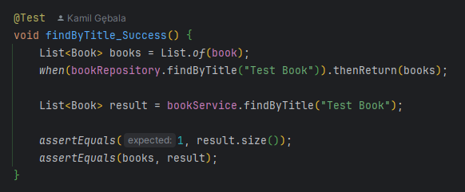

Testy spełniają wymaganie dotyczące pokrycia kodu

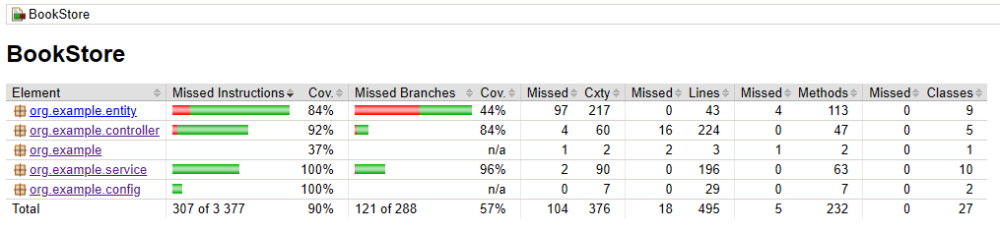

## XIV. Przykładowe działanie projektu (Swagger)

### Logowanie

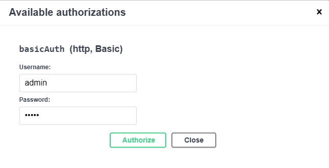

### Wyszukanie wszystkich użytkowników

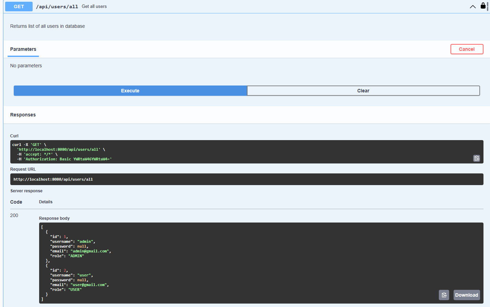

### Wyszukanie wszystkich dostepnych książek

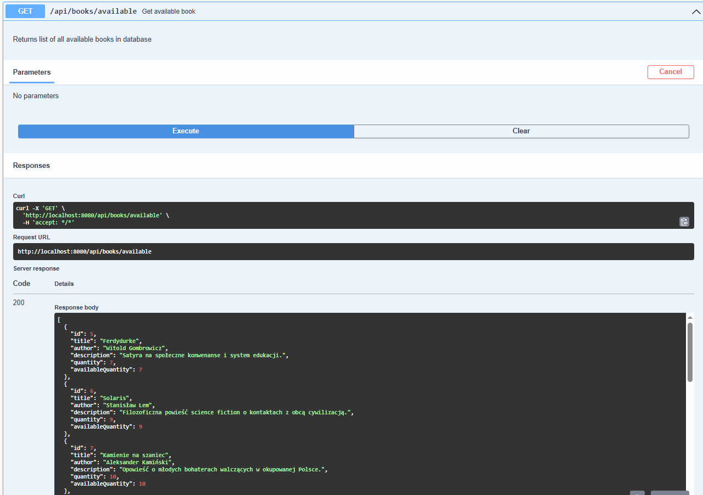

### Stworzenie rezerwacji

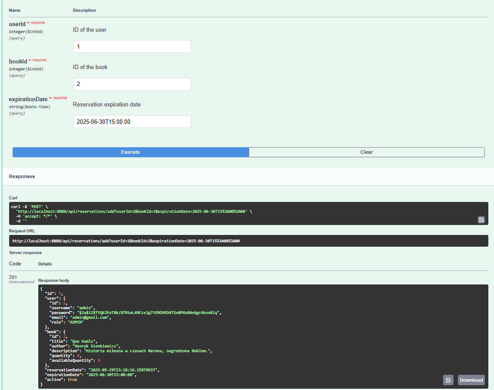

### Anulowanie rezerwacji

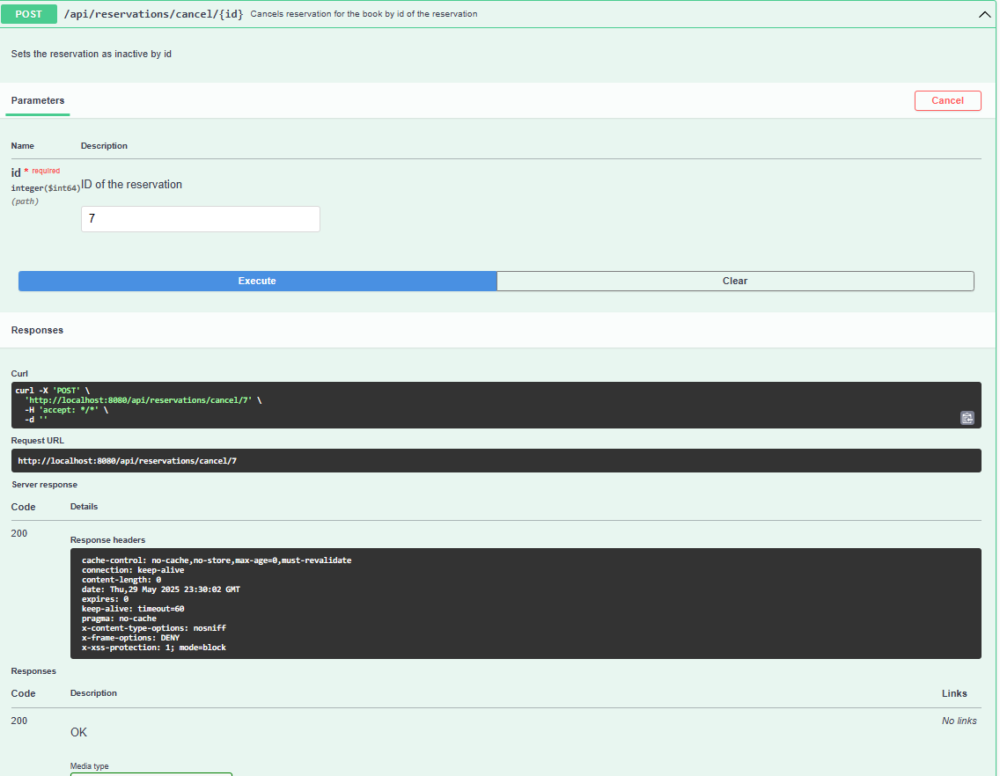

### Stworzenie wypożyczenia

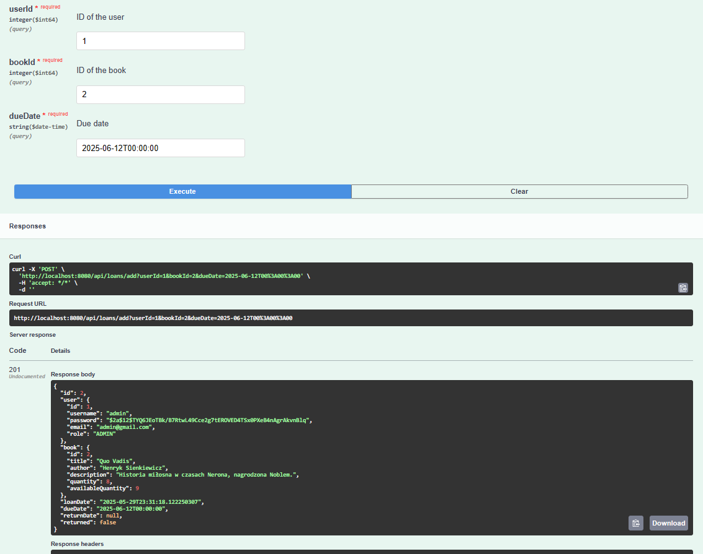

### Pobranie aktywnych wypozyczeń

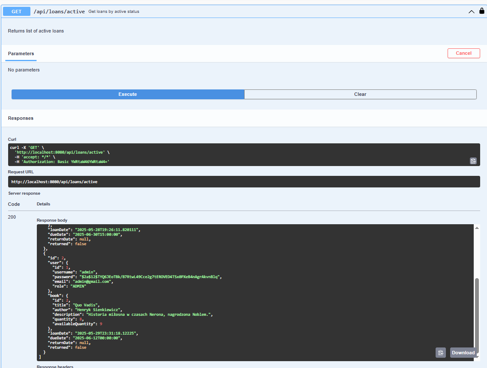

### Zwrot książki

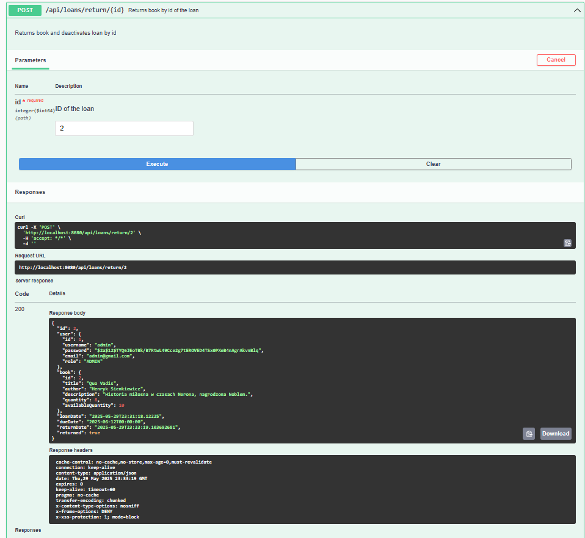

Widać że ksiażka została zwrócona 

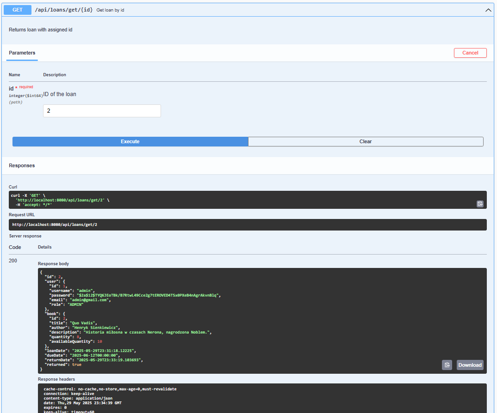

### Rejestracja nowego admina

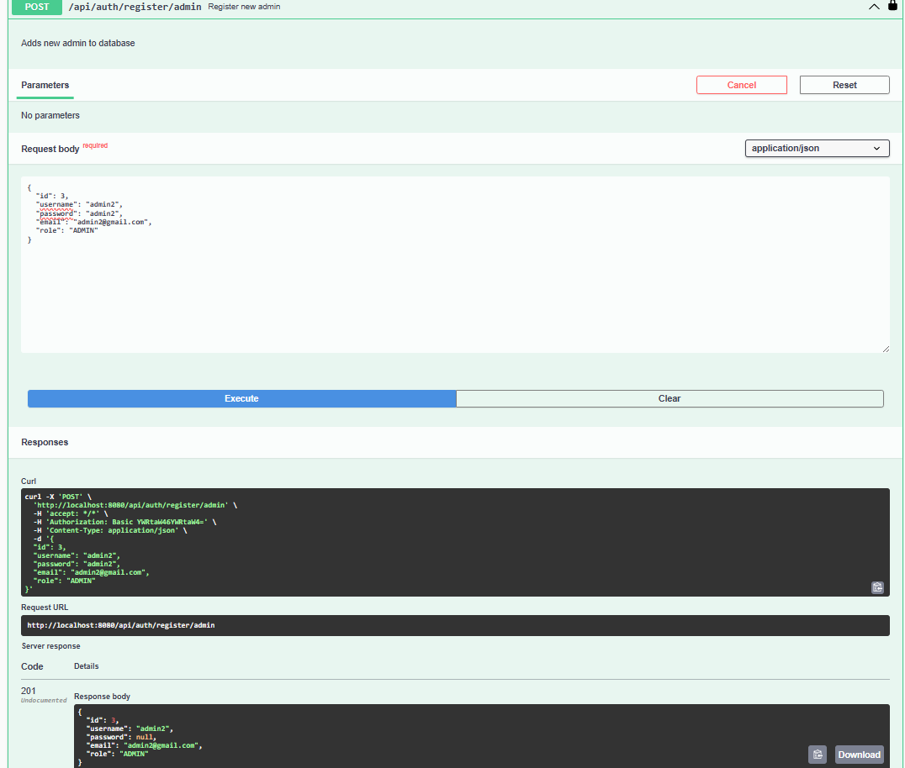
